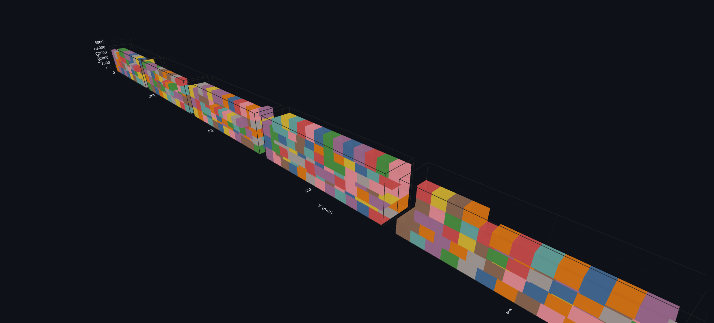

# 3D Container Packing

Nền tảng nghiên cứu có thể tái lập cho bài toán xếp kiện hộp chữ nhật vào
nhiều container dị thể. Project tách biệt dữ liệu, cấu hình, output và
independent validator theo từng level; trạng thái `FEASIBLE` chỉ được chấp
nhận khi validator tương ứng trả `VALID`.



*Minh họa nghiệm đóng gói đa-container ở quy mô 500 kiện. Các container được đặt
nối tiếp trên trục X để quan sát tổng thể; khoảng cách giữa chúng chỉ phục vụ
trực quan hóa, không biểu diễn vị trí vật lý ngoài thực tế.*

## Trạng thái các level

| Level | Phần bổ sung chính | Maturity |
| --- | --- | --- |
| 1 | Hình học, non-overlap, payload, orientation cố định | Nghiên cứu đã nghiệm thu |
| 2 | Floor contact, exact support ratio, base-center support | Nghiên cứu đã nghiệm thu |
| 3 | Xoay ngang `XYZ/YXZ` | Nghiên cứu đã nghiệm thu |
| 4 | Stackability và giới hạn layer | Nghiên cứu đã nghiệm thu |
| 5 | Load-bearing và truyền tải trọng đệ quy | Nghiên cứu đã nghiệm thu |
| 6 | Nesting tường minh theo compound root | Thử nghiệm |
| 7 | Trọng tâm và cân bằng tải | Thử nghiệm |
| 8 | Delivery priority, LIFO và replay tuần tự | Thử nghiệm |

Chi tiết authoritative nằm trong [mục lục tài liệu](docs/index.md). Phân loại
solver, comparator, fixture và exposure được khóa trong
`config/common/capability_matrix.yaml`.

## Cài đặt

```powershell
python -m venv .venv
.\.venv\Scripts\Activate.ps1
python -m pip install --upgrade pip
pip install -r requirements.txt
pip install -e .
```

## Chạy nhanh

Liệt kê capability runtime:

```powershell
python -m container_packing.cli list
```

Chạy tương tác:

```powershell
python scripts\run_experiment.py --interactive
```

Chạy một experiment Level 1:

```powershell
python scripts\run_experiment.py `
  --level level_01 `
  --algorithm extreme_point_best_fit `
  --items-count 20 `
  --containers-count 5 `
  --environment local `
  --non-interactive
```

Kiểm định lại một run:

```powershell
python scripts\validate_solution.py `
  --level level_01 `
  --run-dir outputs\level_01\runs\<run_id>
```

Mỗi lần chạy tạo thư mục bất biến riêng dưới
`outputs/<level_id>/runs/<run_id>/`, gồm manifest, resolved config, input
snapshot, solution, validation, metrics, report và visualization.

## Streamlit

```powershell
python scripts\run_web_app.py
```

UI là adapter mỏng dùng chung application pipeline với CLI. Solver, validator
và simulation logic không nằm trong Streamlit. Xem
[hướng dẫn giao diện](docs/guides/running_web_app.md) và
[kiến trúc web](docs/design/visualization_web_architecture.md).

## Dữ liệu và benchmark

- Dữ liệu ngoài/raw là bất biến; transformation ghi vào `data/interim` hoặc
  `data/processed`.
- Chỉ so sánh hai nghiệm khi input fingerprint, checksum, selection strategy
  và seed tương thích.
- Benchmark lớn, MILP dài và synthetic scale profile được chạy thủ công.
- Trần data-pipeline đã kiểm tra hiện tại là 100.000 items; profile một triệu
  items chỉ là tham khảo và không thuộc acceptance.

Xem:

- [quy trình chạy và kiểm thử thủ công](docs/guides/manual_test_flow.md);
- [productization readiness và shadow evaluation](docs/design/productization_readiness.md);
- [thiết kế benchmark](docs/design/benchmark_design.md);
- [benchmark chuẩn Level 2](docs/benchmarks/level_02_benchmark_v2.md);
- [dữ liệu synthetic quy mô lớn](docs/datasets/large_synthetic_instances.md);
- [quy tắc quản trị tài liệu](docs/design/documentation_governance.md).

## Giới hạn tuyên bố

Đây là nền tảng R&D, không phải hệ thống chứng nhận an toàn vận tải. Mỗi level
chỉ được tuyên bố hợp lệ theo đúng các ràng buộc đang kích hoạt. Các profile
load-bearing, COG, delivery và thời gian vận hành hiện có thể là dữ liệu
synthetic; không được hiểu là thông số vật liệu, phương tiện hoặc quy trình
khai thác thực tế nếu chưa có provenance tương ứng.
