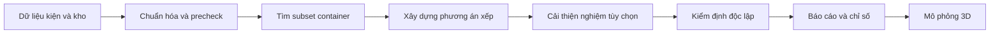

# WIP 4 tuần — Tech doc và kịch bản demo 3D Container Packing

> Cập nhật ngày 2026-08-15 · Thời lượng trình bày đề xuất: 15 phút · Môi trường: local Windows

## 1. Tóm tắt dành cho PM

Sản phẩm WIP là một service nghiên cứu giúp lựa chọn container và đề xuất vị trí
xếp các kiện hộp chữ nhật trong không gian 3D. Người dùng cung cấp danh sách
kiện và kho container; hệ thống trả về container được sử dụng, tọa độ, hướng đặt,
chi phí thử nghiệm, chỉ số sử dụng sức chứa và mô hình 3D tương tác.

Sau bốn tuần, luồng chính từ dữ liệu đến nghiệm và hiển thị đã hoạt động. Phạm
vi đã có evidence chính thức gồm hình học, tải trọng, hỗ trợ hình học, xoay
ngang, quy tắc chồng xếp và truyền tải trọng tĩnh. Mọi nghiệm được báo thành
công đều phải qua một validator độc lập; solver tự báo `FEASIBLE` chưa đủ để
được công nhận.

Đây là nền tảng R&D đã nghiệm thu theo contract phần mềm Level 1–5, chưa phải
hệ thống chứng nhận an toàn vận tải hoặc một production service có SLA.


*Các container được nối tiếp trên trục X để dễ quan sát. Khoảng cách giữa chúng
chỉ phục vụ trực quan hóa, không phải vị trí vật lý ngoài thực tế.*

## 2. Bài toán và giá trị hiện tại

### Đầu vào

- Kích thước và khối lượng từng kiện.
- Kích thước, tải trọng, chi phí và số lượng physical container trong kho.
- Level ràng buộc cần áp dụng và giới hạn thời gian tìm kiếm.
- Tùy chọn thuật toán, số container tối đa và bước cải thiện nghiệm.

### Đầu ra

- Danh sách container thực sự được sử dụng.
- Container, tọa độ và hướng đặt của từng kiện.
- Số container và tổng chi phí theo objective chính thức.
- Báo cáo kiểm định độc lập, diagnostics và lý do thất bại nếu không có nghiệm.
- Bảng utilization và mô hình 3D có thể xoay, zoom, hover theo từng kiện.

### Giá trị đã chứng minh

- Tự động kiểm tra các giới hạn sức chứa chắc chắn thiếu trước khi chạy solver.
- Tìm kiếm trên toàn bộ kho physical container thay vì chỉ lấy một prefix cố định.
- So sánh nhiều constructor trên cùng input và cùng giới hạn thời gian.
- Giữ nghiệm hợp lệ khi repair hoặc bước cải thiện hết thời gian.
- Lưu manifest, checksum, config, seed và output theo từng run để tái lập.

## 3. Luồng xử lý



1. **Chuẩn hóa:** kiểm tra schema, đơn vị, ID và khả năng tương thích cơ bản.
2. **Precheck:** tính cận sức chứa theo thể tích/tải trọng để loại yêu cầu chắc
   chắn không đủ container. Precheck pass không có nghĩa là đã chứng minh xếp
   được về hình học.
3. **Construction:** thuật toán chọn container, hướng đặt, tọa độ và xếp lần lượt
   các kiện.
4. **Repair:** tùy chọn thử đóng bớt container hoặc giảm chi phí; không được làm
   mất incumbent đã hợp lệ.
5. **Independent validation:** tính lại constraint từ dữ liệu gốc, không tin
   trực tiếp kết luận của solver.
6. **Reporting/3D:** chỉ nghiệm complete và `VALID` mới có objective chính thức
   và scene hợp lệ.

## 4. Tiến trình bốn tuần

| Tuần | Thành quả chính | Ý nghĩa |
| --- | --- | --- |
| 1 | Dựng domain model, service chạy thí nghiệm, validator và visualization 3D | Có luồng end-to-end từ input đến phương án hiển thị được |
| 2 | Bổ sung support, xoay ngang, stackability, load-bearing và các heuristic/metaheuristic | Mở rộng dần constraint mà không phá contract level trước |
| 3 | Inventory search, validated incumbent, bounded repair, EP/FFD/MES và benchmark | Có thể tìm trong kho container và đánh giá thuật toán công bằng hơn |
| 4 | Acceptance phân phối Level 3–5, profiling bottleneck, recovery và cải thiện UI | Có evidence nhiều case, biết điểm nghẽn và có luồng demo dễ dùng hơn |

## 5. Maturity Level 1–5

| Level | Bổ sung so với level trước | Trạng thái evidence | Điều chưa được tuyên bố |
| --- | --- | --- | --- |
| 1 | Hình học, non-overlap, payload, hướng cố định | Nghiên cứu đã nghiệm thu | Không chứng minh ổn định vật lý |
| 2 | Tiếp xúc sàn, exact support ratio, tâm đáy được đỡ | Nghiên cứu đã nghiệm thu | Support hình học chưa phải ổn định động lực học |
| 3 | Xoay ngang `XYZ/YXZ` | Nghiên cứu đã nghiệm thu | Không cho mọi phép xoay 3D tùy ý |
| 4 | Stackability, stack group và giới hạn layer | Nghiên cứu đã nghiệm thu | Chưa phải kiểm định độ bền vật liệu |
| 5 | Load-bearing và truyền tải trọng tĩnh đệ quy | Nghiên cứu đã nghiệm thu trên dữ liệu synthetic | Không chứng nhận an toàn cơ học thực tế |

Level 6–8 về nesting, cân bằng/trọng tâm và delivery/LIFO đang ở mức thử
nghiệm. Chúng không được trình bày như thành phẩm đã sẵn sàng trong demo này.

## 6. Thuật toán và objective

Ba constructor chính trong benchmark hiện tại:

- **Extreme Point Best Fit:** mốc đối chiếu thực dụng; đánh giá nhiều vị trí và
  chọn candidate phù hợp nhất theo ranking.
- **First Fit Decreasing (FFD):** xếp kiện lớn trước và nhận vị trí khả thi đầu
  tiên; thường đơn giản, nhanh và deterministic.
- **Maximal Empty Spaces Best Fit (MES):** theo dõi các vùng trống cực đại; có
  thể tìm nghiệm tốt hơn ở một số nhóm case nhưng không luôn thắng.

Objective chính thức được so sánh theo thứ tự:

1. nghiệm complete và independently `VALID`;
2. dùng ít container hơn;
3. nếu cùng số container, tổng chi phí thấp hơn.

Runtime và utilization là chỉ số đánh giá trade-off, không được phép đổi thêm
container để lấy một hình ảnh “đẹp” hơn. Best Fit chỉ là baseline đối chiếu,
không phải optimum đã được chứng minh.

## 7. Evidence đã có

### Benchmark canonical Level 2

- 24 bài kiểm tra, 3 thuật toán, 2 repeat: 144 lượt.
- 144/144 lượt independently `VALID`; 72/72 nhóm deterministic.
- FFD so với Best Fit: 0 thắng / 24 hòa / 0 thua.
- MES so với Best Fit: 1 thắng / 22 hòa / 1 thua.

Điều này cho thấy không thể kết luận thuật toán tốt chỉ từ một hình ảnh hoặc một
case. Kết quả chi tiết nằm trong
[evidence canonical Level 2](level_02_canonical_benchmark_20260813.md).

### Acceptance phân phối Level 3–5

Mỗi Level có 84 bài và 756 lượt, gồm random, stress và prefix regression. Tổng
cộng 2.268/2.268 lượt `VALID`:

| Level | FFD so với Best Fit | MES so với Best Fit |
| --- | --- | --- |
| 3 | 1 thắng / 59 hòa / 0 thua | 18 thắng / 38 hòa / 4 thua |
| 4 | 1 thắng / 57 hòa / 2 thua | 32 thắng / 28 hòa / 0 thua |
| 5 | 2 thắng / 57 hòa / 1 thua | 32 thắng / 28 hòa / 0 thua |

Chỉ nhóm random được dùng cho kết luận thắng/hòa/thua tổng quát; stress và
prefix được báo riêng. Xem
[report Level 3–5](level_03_05_distribution_20260814/cross_level_distribution_report.md).

### Profiling

- Construction chiếm khoảng 59,6% wall time ở Level 3 và khoảng 71% ở Level 4–5.
- Nhóm kiểm tra support/contact chiếm khoảng 54,6%–58,7% profiled solver
  self-time ở Level 4–5.
- Reporting chỉ khoảng 10%–15,5%, nên chưa phải ưu tiên tối ưu đầu tiên.

Hướng kỹ thuật tiếp theo là A/B cache hoặc contact/support index dùng chung,
không mở Level 6 trước khi kiểm soát runtime của core hiện tại.

## 8. Kịch bản demo local 15 phút

### Checklist trước buổi demo

1. Mở PowerShell tại project root và kiểm tra virtual environment:

   ```powershell
   Set-Location D:\IT\Project\gsm\3DBinPacking
   .\.venv\Scripts\python.exe --version
   ```

2. Chạy targeted smoke test để xác nhận UI khởi động:

   ```powershell
   .\.venv\Scripts\python.exe -m pytest -q tests\test_streamlit_app.py
   ```

3. Khởi động ứng dụng trước giờ trình bày:

   ```powershell
   .\.venv\Scripts\python.exe .\scripts\run_web_app.py
   ```

4. Giữ sẵn tài liệu này, ảnh 500 kiện và evidence Level 2 làm fallback.
5. Không chạy benchmark 144/756 lượt trong buổi demo.

### 0–2 phút — Bài toán và kết quả WIP

**Thao tác:** mở phần đầu tài liệu và ảnh 3D.

**Câu nói gợi ý:**

> Đầu vào là danh sách kiện và kho container. Hệ thống tìm container cần dùng,
> tọa độ và hướng đặt cho từng kiện, sau đó kiểm định độc lập và hiển thị kết
> quả 3D. Mục tiêu ưu tiên ít container, rồi mới đến chi phí.

### 2–4 phút — Vì sao kết quả đáng tin trong phạm vi đã khai báo

**Thao tác:** chỉ vào sơ đồ luồng xử lý.

**Câu nói gợi ý:**

> Solver không được tự chấm nghiệm của mình. Nghiệm complete phải qua validator
> riêng, đọc lại input gốc và kiểm tra toàn bộ constraint của Level đang chọn.
> Vì vậy trạng thái FEASIBLE chỉ được công nhận khi validation là VALID.

### 4–10 phút — Chạy demo Level 2

Thiết lập trên sidebar:

| Mục | Giá trị demo |
| --- | --- |
| Ngôn ngữ | Tiếng Việt |
| Cấp độ | `level_02` |
| Nguồn dữ liệu và kho container | Kho nghiên cứu — 1.000 kiện / 500 container / 10 loại |
| Thuật toán | Extreme Point — Best Fit Decreasing |
| Số lượng kiện | 100 |
| Tìm container tốt nhất trong toàn bộ kho | Bật |
| Số container bắt đầu tìm | 1 |
| Tự tăng khi chưa có nghiệm | Bật |
| Số container tối đa được dùng | 10 |
| Thời gian tối đa | 60 giây |
| Cải thiện nghiệm sau construction | Tắt |

Nhấn **Thử nghiệm** và giải thích trong lúc chờ:

> 500 container là toàn bộ kho khả dụng, không phải số container bắt buộc dùng.
> Hệ thống bắt đầu từ số nhỏ, bỏ qua các mức chắc chắn thiếu capacity và chỉ mở
> thêm container khi chưa có nghiệm.

### 10–12 phút — Đọc kết quả

Chỉ vào các phần sau:

- `VALID`: nghiệm đã qua validator độc lập.
- Container đã dùng và chi phí: hai thành phần của objective.
- Payload/volume utilization: chỉ số chẩn đoán, không phải objective thay thế.
- Mô hình 3D: xoay, zoom và hover một vài kiện; mở view riêng một container nếu
  combined view quá dài.

Không gọi khoảng trống nhìn thấy là packing kém ngay: container có thể đã gần
hết payload hoặc bị giới hạn bởi hình học/support.

### 12–14 phút — Benchmark thay cho nhận xét một case

Mở tab **So sánh benchmark**, nhưng không chạy benchmark dài. Sau đó mở
[evidence canonical Level 2](level_02_canonical_benchmark_20260813.md).

**Câu nói gợi ý:**

> Một case demo chỉ chứng minh service chạy được. Muốn đánh giá thuật toán phải
> chạy cùng input, kho, constraint và deadline trên nhiều case. Benchmark hiện
> cho thấy phần lớn kết quả hòa, MES thắng một case và thua một case; do đó chưa
> có thuật toán thắng tuyệt đối.

### 14–15 phút — Kết luận và roadmap

> Thành phẩm WIP đã có service, validation, output tái lập, mô phỏng 3D và
> benchmark nhiều case. Profiling cho thấy bottleneck tiếp theo nằm ở kiểm tra
> contact/support trong construction. Bước tiếp theo là tối ưu index/cache và đo
> lại trước khi mở rộng constraint mới.

## 9. Phương án dự phòng

| Sự cố | Cách xử lý trong buổi demo |
| --- | --- |
| Streamlit chưa mở | Chạy lại `scripts/run_web_app.py`; tiếp tục trình bày tài liệu trong lúc chờ |
| Run 100 kiện lâu bất thường | Dừng chờ, đổi xuống 20 kiện; không tăng timeout vô hạn |
| Không có scene do run thất bại | Đọc reason code; dùng ảnh 500 kiện và evidence đã lưu |
| Mạng bị chặn | Demo local không phụ thuộc GitHub hoặc Internet |
| Benchmark history không xuất hiện | Mở report Markdown đã commit, không chạy lại corpus dài |

## 10. Câu hỏi thường gặp

**Đây đã là giải pháp tối ưu chưa?**

Chưa. Các heuristic tạo nghiệm hợp lệ và thực dụng nhưng không chứng minh tối
ưu. Best Fit là baseline; lower bound cũng chỉ là cận sức chứa sơ bộ.

**Tại sao container còn khoảng trống?**

Không gian trống có thể do payload đã đầy, hình học không tương thích, yêu cầu
support/chồng xếp hoặc do heuristic chưa tìm được cách gom tốt hơn.

**Benchmark có phải một thuật toán chuẩn không?**

Không. Benchmark là một protocol gồm dataset, danh sách case, thuật toán, seed,
deadline, repeat và cách tổng hợp. Các thuật toán được chạy trên cùng case rồi
mới so thắng/hòa/thua.

**Có chạy được 10.000–100.000 kiện không?**

Pipeline dữ liệu đã có profile lớn, nhưng solver scale lớn chưa qua acceptance
runtime/memory tương ứng. Demo và evidence chính hiện dùng nguồn 1.000/500.

**Kết quả có dùng được để xếp hàng thật không?**

Chỉ sau khi thay dữ liệu synthetic bằng dữ liệu có provenance thực tế, hiệu
chỉnh constraint vật lý và hoàn thành acceptance/SLA production. WIP hiện chứng
minh correctness phần mềm trong phạm vi contract đã khai báo.

## 11. Thuật ngữ

| Thuật ngữ | Giải thích ngắn |
| --- | --- |
| Heuristic | Quy tắc tìm nghiệm nhanh, không bảo đảm nghiệm tối ưu |
| Benchmark | Bộ bài kiểm tra và quy trình chạy cố định để so sánh công bằng |
| Case | Một bộ input cụ thể: tập kiện, kho, constraint và giới hạn chạy |
| Execution | Một lần một thuật toán chạy trên một case |
| Validator | Thành phần độc lập tính lại constraint từ input và solution |
| Lower bound | Cận dưới sơ bộ; không thể dùng ít hơn nhưng chưa chắc đạt được |
| Inventory search | Tìm tổ hợp physical container phù hợp trong toàn bộ kho |
| Incumbent | Nghiệm hợp lệ tốt nhất đang được giữ trong quá trình tìm kiếm |
| Repair | Bước tùy chọn thử cải thiện incumbent sau construction |
| Profiling | Đo thời gian từng phase/hàm để xác định bottleneck |
| Deterministic | Cùng input/config/seed cho cùng objective và placement signature |
| WIP | Work in progress — sản phẩm đang hoàn thiện, chưa phải bản production |

## 12. Tài liệu đối chiếu

- [Mục lục tài liệu](../../index.md)
- [Contract Level 1](../../levels/level_01.md) đến [Level 5](../../levels/level_05.md)
- [Hướng dẫn chạy Streamlit](../../guides/running_web_app.md)
- [Benchmark canonical Level 2](level_02_canonical_benchmark_20260813.md)
- [Acceptance và profiling Level 3–5](level_03_05_distribution_20260814/cross_level_distribution_report.md)
